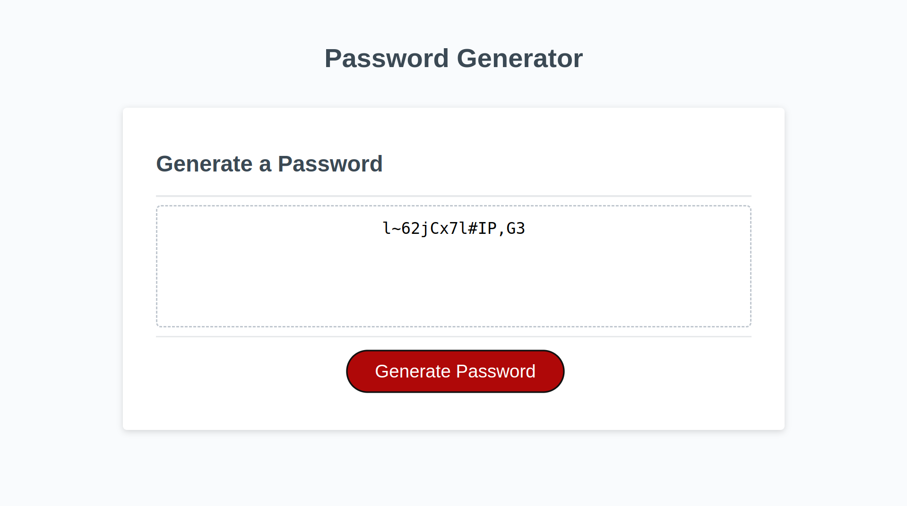
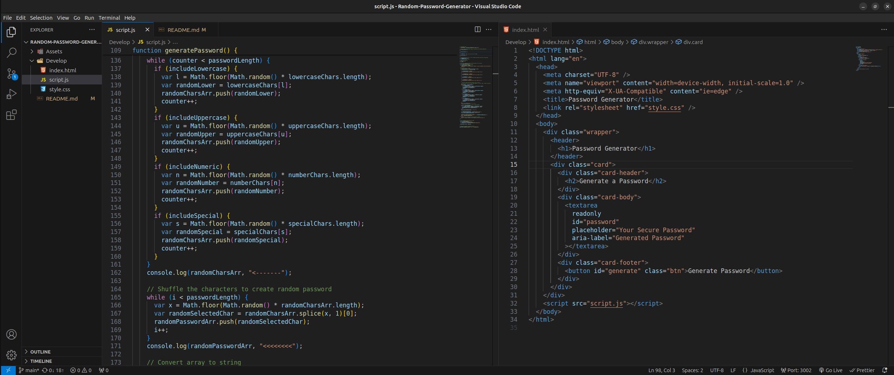

# 03 JavaScript: Password Generator

## Project Overview

The goal of this project was to modify starter code to create a browser-based application that allows employees to generate random passwords based on specified criteria. The application features dynamically updated HTML and CSS, powered by JavaScript, ensuring a clean, polished, and responsive user interface adaptable to various screen sizes.

## Live Demo

To visit the live website, <a href="">click here</a>

## Key Features And Accomplishments

- Included a series of prompts for password criteria selection which is triggered when the button is clicked.

- User inputs a password length ranging from 8 to 128 characters when prompted.

- User can then select from various character types including lowercase, uppercase, numeric, and special characters to tailor the password to specific security requirements.

- Once all prompts are answered, the application dynamically generates a password that adheres to the selected criteria.

- Lastly, the generated password is displayed in an alert & is written directly to the page, providing a seamless and accessible user experience.

## Website Preview

## Code Preview

